# Cancer Informatics for Research Leaders

Informatics research often requires multidisciplinary teams. This requires more flexibility to communicate with team members with distinct backgrounds. Furthermore, team members often have different research and career goals. This can present unique challenges in making sure that everyone is on the same page and cohesively working together. This course aims to provide research leaders with guidance about:  

 1) How to effectively lead team members on informatics projects  
 2) How to perform informatics projects well   

We will provide you with an awareness for the **specific challenges** that your informatics collaborators, employees, and mentees might face, as well as ways to mitigate these challenges. By creating a better work environment for your informatics research team, you will ultimately improve the potential impact of your work. 

We will also discuss the major pitfalls of informatics research and discuss best practices for performing informatics research correctly and well, so that you can get the most out of your informatics projects. 

## Guidelines for working with informatics experts

In order to familiarize you with guidelines for how to make the most out of your informatics projects we are going to introduce you to some characters of the type of people you may encounter on your journey. 

First our fearless lab leaders who lead informatics research projects. We have Sally who is experienced with working with team members from many disciplines including informatics experts. She helps guide her lab through successful projects all the time.

Next, we have Charlie. He is new to informatics research and could learn a bit about how to work with informatics experts more effectively.

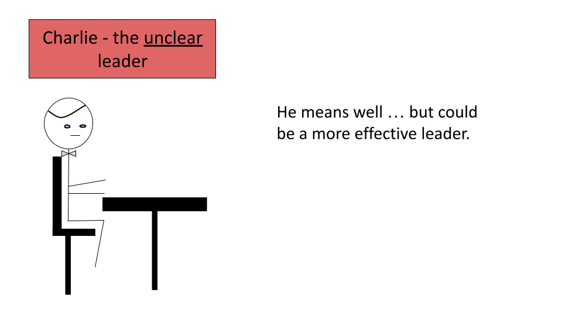

Now we have our informaticists. First is Jack, who is often forgotten by his lab leader.

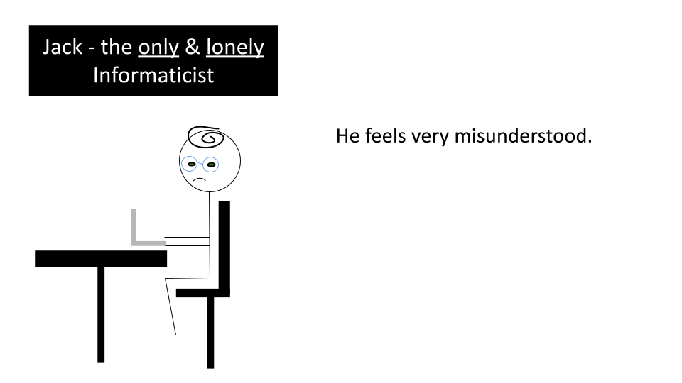

We also have Hilda, an example of a happy informaticist. She feels supported in all the ways that she needs, allowing her to be as productive and helpful as possible.

Here is Francis the frustrated collaborator.

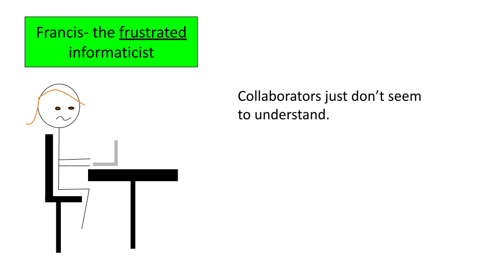

Finally we have Harry, the helpful collaborator.

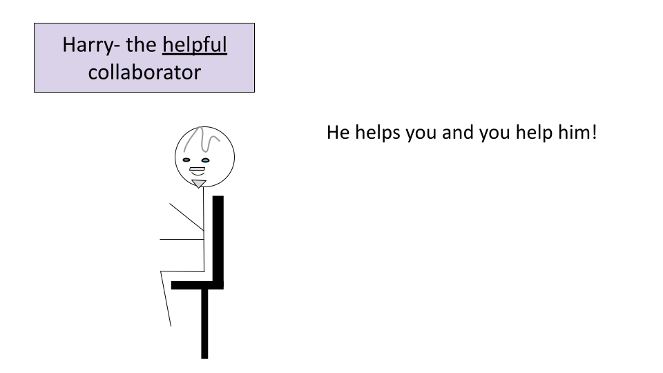

We will now describe some guidelines for how to be an effective leader, collaborator and mentor on informatics projects so that you can be more like Sally with mentees and employees like Hilda and collaborators like Harry.

### Finding and creating good relationships for informatics projects

The first step to performing a good research study is to find the right people for your research team. 

We suggest that you look out for collaborators before you even design your studies. If you are new to informatics and you plan to employ or mentor informatics experts in your lab, we suggest that you seek help from an informatics expert before you start an informatics project. 

This section is based on a [blog post](https://simplystatistics.org/2011/10/20/finding-good-collaborators) from [Roger Peng](http://www.biostat.jhsph.edu/~rpeng/) of the [simply statistics](https://simplystatistics.org/) blog which has many other useful discussions and resources. 

In this section we will provide a guide for finding good coworkers, whether they are mentees, collaborators, or employees, to work on informatics cancer projects particularly for multidisciplinary teams.

1) **Look for people who are easy to communicate with.**

Especially for projects with multidisciplinary teams, good communication is vital. Look for people who are **easy to talk to**.

This can **vary** by your unique personality traits, but in general we suggest that you look for people who are:

 - compassionate/polite   
 - explain clearly  
 - seem open and enthusiastic to learn new things  
 - respect your knowledge  
 - appear to get things done (based on their CV and or reputation)

In Roger's words:

> "If you dont feel comfortable asking (stupid) questions, pointing out problems, or making suggestions, then chances are the science will not be as good as it could be."

2) **Take your time** 

It is not always obvious who you feel most comfortable working with until you encounter an issue. In the case of finding a collaborator, take the time to get to know people at seminars and workshops. Chat with people casually about your work.

For emplyees and mentees, allow time to get comfortable talking to one another. Given the power dynamic, it is important to openly express areas that are new to you and communicate respect for their knowledge. 

In all cases (with collaborators, employees, and mentees), build in extra time for projects to allow for teaching time. You can teach them about your domain and they can teach you about theirs. This may feel like it is taking extra time but it will ultimately pay off in the end, as you will better be able to work as a team to ask the most **useful and testable** hypotheses.

3) **Schedule extra time**

As a project continues, new challenges will arise that will again require more time for teaching one another about the scientific process specific to your domain. Build in breathing room in the project schedule where possible, to allow for time for setbacks. **Keep in mind that you may be unaware of the setbacks that you may encounter for work outside of your expertise.** Creating a situation that is less stressful makes it easier for everyone to maintain positive relationships.

### Identifying good informatics questions

Once you have identified your research team, your next step is to start thinking more deeply about the specific informatics questions you would like to evaluate. **Be sure to include team members of each discipline in these discussions.**

There are many important considerations to keep in mind when asking an informatics question: 

1) Is it testable experimentally and statistically speaking?
2) Is it feasible (in terms of cost, time, resources - such as data storage)? Does public data already exist?
3) Are we using the appropriate methods (experimentally and statistically)?
4) Are we considering confounders, biases, controls etc.?
5) What will this mean for science and my lab members if this succeeds?
6) What will this mean for my lab members if this fails? Is there a back-up plan?

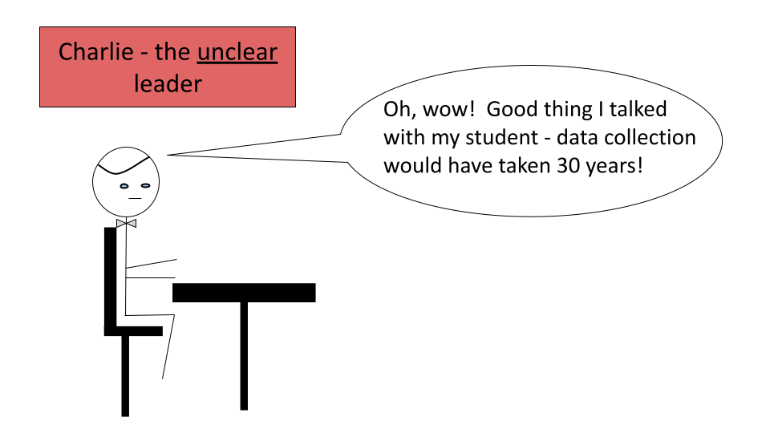
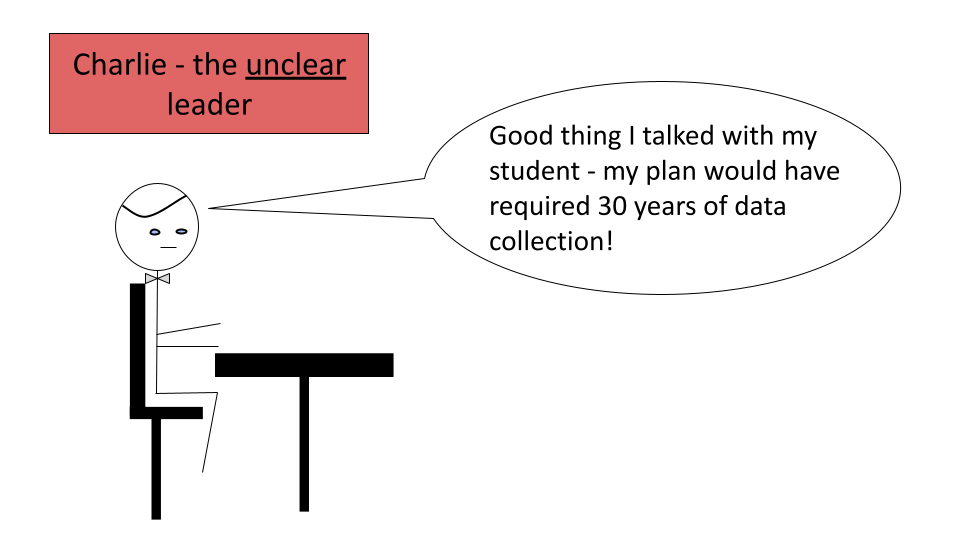

We suggests the following steps to take a great scientific question and make into a great statistically testable question.

#### Steps for forming questions

1) Start with what you know and determine what is unknown
2) Clarify what is most important to learn about what is unknown. What key information would lead to more understanding? What would be most helpful to know to lead to a new treatment or prevention strategy? What would lead to more questions?
3) Narrow down what is unknown into specific statements based on what you identified as important to know from step 2.
4) Write the unknown statements into specific questions. (Look out for vague phrases!)
5) Make the questions into actionable tests by thinking about what would be measured or observed and ultimately what your variables would be in a statistical test.
6) Make a mock-up of what the data would look like. (Do you have any necessary controls?)
7) Evaluate if that actionable test can be assessed with statistical methods and if you have access or can collect the necessary data. Rework as necessary, possibly returning to a different question from step 5. Think about possible biases or confounders.
8) Evaluate if the interpretation of the test would provide the insights that you are interested in.

For example, say we were interested in identify new diagnostic biomarkers for colerectal cancer. 
***Note:** this is only an illustrative example.*

#### STEP 1

First we would identify what is known and unknown:

Several potential blood-based biomarkers have been identified, however many are lacking evidence due to the previous studies having small sample sizes. 

[[source]](https://www.frontiersin.org/articles/10.3389/fonc.2019.01284/full) 

You might ask how useful are these biomarkers for diagnosing colorectal cancer? 

So now we think about what is unknown:

You know the sizes of the previous samples that have assessed these biomarkers and you know the level of sensitivity reported by previous reports. However, it is unknown how sensitive and specific some of these biomarkers are with sufficient sample sizes. It is unknown how collectively these biomarkers help to identify patients with cancer. It is unknown which biomarkers are more important. It is unknown which biomarkers or combinations are particularly useful for determining disease progression or what treatment options might be best.  

#### STEP 2 p 

Step 2 then involves determining which unknowns are the most important to you. This could be what is more translatable to aiding better diagnostics in a noninvasive way. This could be to better understand cancer progression and what these biomarkers tell us about patient prognosis. Determine what unknowns best fit your interest/expertise. Let's say that we want to know what is most translatable to aiding diagnostic tests now. 

#### STEP 3

Step 3 then involves writing out specific statements for what is unknown related to making these biomarkers more useful for tests now. 

It is unknown how useful many of these biomarkers are individually for the diagnosis of colerectal cancer in larger samples. It is unknown if combining these biomarkers together is useful in diagnosis colerectal cancer. It is unknown if combining these blood-based screens with other screens is useful. 

You can probably imagine many more statements but we will keep this example simple.

#### STEP 4

Step 4 involves transforming these into questions:

How useful are these biomarkers for the diagnosis of coleretal cancer? 
How useful is the combination of these biomarkers for the diagnosis of colerectal cancer?
How useful is the combination of any of these biomarkers with other non-blood-based screens?

Look for terms of phrases that our vague in your questions and make them more specific. For simplicity purposes we will stick with only the second question.

The phrase "How useful" can be more specific.

Does a combination of the detection of these biomarkers improve diagnostic sensitivity for colerectal cancer than single biomarkers alone?

Ok that's getting better!

#### STEP 5

Step 5 is to transform questions into actionable tests. For a question to be testable it must meet several requirements. We need to have variables that can be measured or observed. We need to have a variable we can modify or control and we need to figure out what we cannot control. 

Now what are our variables, what can we control or observe? We will be observing diagnostic rates of colerectal cancer and biomarker expression, and we can modify or control how many biomarkers we choose to focus on to compare samples. 

This leads to many questions: 

Should we compare one biomarker vs all of the biomarkers?
Which single biomarker will we choose to compare to or will we look at all of them? 
Do we have the sample sizes to allow for the statistical power for so many tests? 
How will we look at the combination of biomarkers? A total score? 
Will it be additive or something more complicated? For example we could prioritize some biomarkers over others. 

These are good questions to ask an informatics expert about. However we are getting to a more testable question. Now let's really think about what the data we would need and what it would look like.

Which brings us to step 6 where we create a mock-up of the data.

#### STEP 6

Creating a mock-up of the data can make you ask yourself more questions about what you are asking and what you need to ask that question.
Would it be that we have blood results for these biomarkers for patients where we know based on surgical pathology if they have cancer?

What would these blood results look like? 
Would it be absolute expression levels of mRNA or protein? 
Do we have a threshold of elevated expression that we can use? 
Will we assign samples as yes or no in terms of meeting this threshold or will we use an absolute quantity or relative percentage over this threshold? 

Actually creating a mock-up of what the data might look like can reveal other important aspects that you may not yet have thought about. Thus here is the result of step 6.

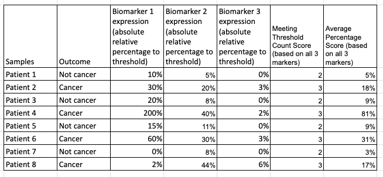

#### STEP 7

Step 7 is then to think about what statistical tests you might perform. Could we use a t-test to compare the scores among the patient groups? Would we want to account for other factors like the patients age or gender? Would another test be better? 

#### STEP 8

Step 8 is then to think about what this would mean. What would it mean if our results showed a difference in score between the groups? What can we interpret? Do we want to be able to predict patient status? This may involve moving back a step or two. 

Remember that working with your research teammates can help you to come up with a better research plan before you start collecting data. By involving experts from different domains you can make the most out of your research efforts. 

We would also suggest that you work with your informatics experts to come up with a biological research question or set of questions and a more technical question for each project. This can be a good strategy to ensure that everyone in your team gets authorship and that your team is being as productive as possible.

For this example, your informatics employees or students might write a paper using simulated data or publicly available data to look at methods for creating biomarkers scores. Their studies could better inform you about how to think about testing the utility of colerectal biomarkers for diagnosis purposes.

### Starting a project

Communication is vital for all good work relationships, but especially in a multidisciplinary team. Here are a few tips for keeping communication smooth regardless of if you are an informatics expert yourself or you are employing, mentoring, or collaborating with an informatics expert as you get started on a new project. 

1) **Talk first**

Start talking to your collaborators, students, or employees  **before** you even begin a project, so that you can plan the project in the optimal way. This is especially critical for forming the right statistically testable and scientifically useful questions and for collecting the right data to address such questions.

Collecting the **right** data can be vital to the success of a project. It may not always be obvious what is possible for the experimental biologists to create samples. Is 30 samples actually feasible? How about 300? Would that be performed in different batches?
What is necessary or possible for an informatics project to be able to test certain questions with statistical methods? How long would certain analyses take?

These are discussions that should happen long before regents are purchased, before IRB submissions, and before grant submissions if possible.

2) **Come up with questions/hypotheses together**

Not knowing what may be feasible in terms of data collection and analysis can make it nearly impossible to form an appropriately testable hypothesis. Furthermore, it may be difficult to know how your questions fit into the context of a field and what is actually useful to advance treatment and prevention if you are not a domain expert of the cancer or disease that you are studying. By working together in multidisciplinary teams we can determine the best hypotheses to advance science. 

Domain experts can help to ensure that the question is feasible from a standpoint of data collection, that it leads to other important questions, that it is new, that it is useful, and that the plan to test it will actually lead to interpretations that are useful.

Informatics experts can help to ensure that the question is feasible from as standpoint of data collection and data analysis, that a question is testable, and that it leads to the interpretations that the domain experts hope to gain.

See the next section about forming good informatics questions.

3) **Be specific**

Give and ask for specific feedback. If your collaborator/employee/student says something that you do not quite understand, ask them for more specific clarification. In addition, give feedback that is specific where possible without assuming knowledge that might be necessary and avoid jargon. 

For example, if the number of samples would be underpowered for a specific statistical method, simply stating this is not enough. State that you believe that the sample size is too small to allow for specific statistical text XYZ to be utilized. 

4) **Be compassionate**

Consider the stage of the project and how your discussions may impact your coworker.

For example, pointing out that there is not enough data to do what your collaborator had hoped during later stages of the project can be very disappointing as it is often not possible to collect new data. Being polite and considerate when you make suggestions can make a major difference. Furthermore, suggesting an idea about how the project can still be productive can save your collaborator/coworkers/students stress and heartache. They may not be aware that there is public data available that can still save the project.

5) **Keep organized records of communication**

Keep a record of your communications. Organizing your emails for projects into a separate folders with easily recognizable titles can save you hassle later when something comes into question. 

6) **Keep organized records of work**

Besides recording communications, record and communicate notes about your data collection and analyses. Be mindful of overwhelming your coworkers of course, but generally speaking provide extra information where possible. The more people aware of details about what samples where in what batch, the more likely important details are not missed or forgotten. For example if you are sending data to a collaborator send as much information as possible about how it was generated in the email in which you send it to them, even if you have already discussed the data. This can help ensure that no important details fall through the cracks. The best way we think you can do this in general is to use reports - our next suggestion.

7) **Use reports**

Instead of sending informal short emails (which are useful at some points in a workflow), we suggest intermittently sending lab reports with as much information about what was done and why as possible. For informatics related work in R or Python (or other supported languages) we **highly** suggest using R markdown or jypter notebooks to track what informatics steps you have performed and why. Beginning these reports with a short description of what the data was that you used and when you received it can be critical for ensuring that you are using the correct data! We will describe more about how to use such reports in the data management section of the course.

8) **Keep contact**

Regular communication continues the momentum of a project and ensures that important details get discussed when necessary. It also relieves anxiety among coworkers by keeping everyone aware of the status of the project and helping to start discussions if someone needs help.  

AVOCADO create graphic and add references from Jeff

### Good informatics leader practices

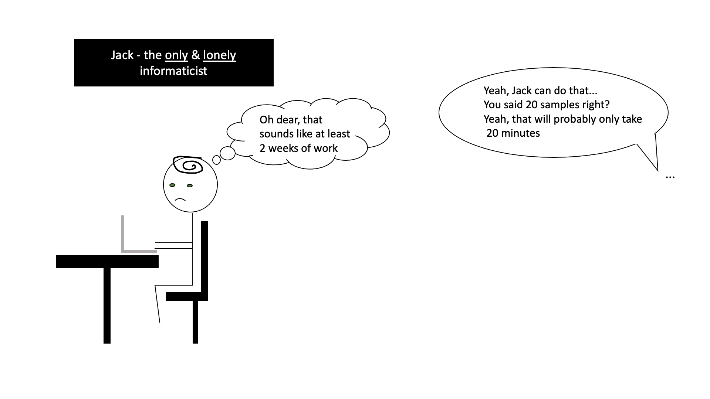

The section is based on a famous [blog post](http://www.opiniomics.org/a-guide-for-the-lonely-bioinformatician/) written in 2013 called "The lonely bioinformatician" that describes the angst that informatics personnel often feel  when they are the only person in thier lab with their skill set. The blog post author, [Professor Mick Watson](https://www.ed.ac.uk/profile/mick-watson) at the University of Edinburgh, describes these individuals as "pet bioinformaticians" in his blog called [opiniomics](opiniomics.org).

He states: 

> "it is possible they [the pet bioinformaticians] will become isolated and pick up bad practices as they don’t have a senior bioinformatician to guide them. It also concerns me that their career and profesional development might suffer."

He also acknowledges the challenges of the opposite case:

> "Consider the opposite situation – how many bioinformatician PIs manage lab staff?  How could we possibly guide a young post doc on how to run gels, PCRs etc nevermind more complicated laboratory SOPs?"

He has since then stated for the PIs of experts who do not share the same skill-sets:

> "Just look after them, and recognise you can’t give them everything that they need.You can give them a lot, just not everything."

> "Secondly, there is nothing wrong with being a pet bioinformatician – it can be a really stimulating role, and opens your eyes to lab-based science.  I am not criticizing the pets either, I just urge you to look after yourselves." 

And ultimately provides a [guide](http://www.opiniomics.org/a-guide-for-the-lonely-bioinformatician/) for the "pet bioinformaticians" that can be useful for both informatics expert employees and also for leaders of such individuals as well as for informatics lab leaders who employ lab-based scientists.

Extending the major themes from [his guide](http://www.opiniomics.org/a-guide-for-the-lonely-bioinformatician/) and from his post about [clinical labs](http://www.opiniomics.org/the-lonely-bioinformatician-revisited-clinical-labs/) here are guidelines for lab leaders:

1. **Avoid employee isolation**

If possible, employ more than one informatics expert or at least collaborate heavily with others - especially those with experience working with human data. Alternatively hire a more senior expert (with expertise studying in the domain you intend) with a higher salary.  

In Mick Watson's words: 

> "I am aware of a few lone bioinformaticians working in clinical labs.  I want to make this clear – this is a bad idea.  In fact, it’s a terrible idea.  Through no fault of their own, these guys will make mistakes.  Those mistakes may have dire consequences if the data are then used to inform a treatment plan or diagnosis."

In any case, we highly encourage guideline #2 regardless of what option you choose.

2. **Encourage relationships with others in their domain**

Enable and encourage your employee to cultivate relationships with others who have similar skill-sets at your institution or local community.  If there is no local group of such individuals, see if your employee would be interested in starting one - such as a seminar group or journal club. Also encourage them to join online forums and attend conferences and workshops.

AVOCADO Examples?? - Seems like the ITCR community could be very helpful and should be listed - but also probably smaller cancer specific forums? 

3. **Encourage growth outside their domain**

On the other hand, it is important that you also cultivate and encourage your employee's growth in your domain by again suggesting and enabling their participation in conferences and journal clubs on topics relevant to your lab.  

4. **Value their perspective about science in general**

Encourage feedback and discussion from all of your employees in scientific discussions. Make their input feel welcomed regardless of the topic. A fresh perspective can sometimes lead to really important insights about things that are taken for granted by experts.

5. **Discuss expectations and hypotheses**

If your employee is helping with work for a grant, provide the proposal to them. Have a discussion with your employee about your expectations and how feasible they are, as well as to make your informatics hypotheses specific. Avoid projects where the informatics goals are vague. Also remember that many informatics tasks may take more time than you anticipate and your employee may have a better sense of how long something will take. (or vice verse if you are an informatics expert employing lab scientists). Be clear with your employee in these discussions that you are unclear about how long tasks will take, if that is indeed the case. Continue to have open dialogue about expectations and goals as the work proceeds.

6. **Advocate authorship and idea generation for all**

Regardless of your emloyees' or students' backgrounds, make sure you advocate for authorship for each of them (particularly if they are interested in a career in research). Informatics experts will also need **first author papers**. Allow your employees to **generate ideas** for such publications and discuss this with them. Often the work to help with other projects  may not be as interesting for your employee as an idea that they come up with themselves. 

Often you can create one technical paper and one biological paper from each project. 

If nothing else, even if your employee is very busy on work for mid-level authorship, give them time to write a review or a software paper for a simple package, or a comparison of informatics methods. [Mick Watson](https://www.ed.ac.uk/profile/mick-watson) suggests making sure that your employees are authoring ~2 first author publications a year if possible. If necessary you can front-load collaboration work and then give your employee more time later to spend on their own work, but be careful about not protecting some of their time for their own career advancement. Also please see the Career Paths for Informatics Mentees section (coming up soon) and read it with your employees in mind, as well. 

7. **Check on them!**

**Most importantly**, make sure that your employee is getting help and feedback from other informatics experts. It can be easy for your employee to get stuck or go in the wrong direction if left in isolation.  How can you do this? Keep tabs on what they are doing in general, if they are still working on the same issue for an extensive amount of time, suggest that they seek help. Also by encouraging the relationships with other informatics experts you will provide them with the opportunity to ask others for their thoughts. 

8. **Get external review of work**

Particularly in informatics, we can especially track our steps. Make sure that your employees are keeping detailed records about their work and then get them to regularly ask for feedback from others. We all make mistakes, it's good to get external feedback early and often to ensure that the work is correct.

AVOCADO will make graphic of this

AVOCADO... where to put this:

Need to add  "deep work" and the value of uninterrupted time for an analyst

### Informatics project pitfalls

One common misconception is that informatics research projects work out more often or are faster than wet bench experimental research projects. This is however not necessarily true and informatics projects are just as likely to fail and often take more time than one might expect. However, one advantage of having an informatics team member on a project is that there is ample free data available to add to or shift or reframe a study if necessary. This is important to keep in mind when advising your mentees and guiding the planning of their projects.

Common reasons why an informatics project might fail:  

1) The goals were too vague  (see the previous section about identifying good informatics questions) 
Sadly this happens quite often and it can easily lead informatics emloyees and mentees down the wrong path.

2) The data is not of high enough quality or lacks consistency  
This may be do to a faulty method, methodological differences between lab personnel, expired reagents, temperature differences on data collection days, or aging of a machine over time etc. Some of these issues can be avoided or reduced, while others are unavoidable. Do not be quick to blame your experimental research team members if the data does not look like you expect. Some variation in data is just a part of life. 

3) There is not a strong enough signal in the data to detect the effect of interest with the current data/methods
This is also a very common problem if you are not sure what the strength of the effect you are looking for might be (which is often the case in Biology). In this case you need more data or methods with greater granularity.

4) The method of data collection becomes obsolete

This may not make the project fail per se but can make publication difficult. Staying on top of what methods are currently being used can help to avoid this.

5) The signal does not exist

Sometimes our hypotheses are just wrong. 

AVOCADO -Add reference to the book

We can mitigate some of these project weak points. (You may notice how some of these have been discussed previously.) However some of these are a bit unavoidable and it is best to have realistic expectations and flexibility about backup project ideas.

Ways to mitigate project failure:

1) **Discuss with experts**
Discuss with trusted experts across all necessary domains about your informatics hypotheses to make sure they are feasible with the data you have or will generate before you get too far down the research path. Ask for their help to make sure that your scientific questions are not too vague. Do this as early as possible.

2) **Diversify projects**  
It is a good idea to diversify your mentees' and employees' projects to enable them to have exposure to different projects, as well as more opportunities to contribute to a project that will ultimately result in a product such as an academic paper or a new software package. 

3) **Safe project planning**  
Make sure mentees and employees have at least one very solid project. For example, assign a review article, a simple software package, or a project with very promising pilot data.

4) **Co-authorship**  
Allow lab members (especially mentees) to work together on projects. Assign one mentee or employee as the main personnel, but allow other team members to contribute in small ways to allow them to at least get co-authorship, just in case their main projects fail. 

5) **Plan for ample time**  
Plan for projects to have adequate time to account for setbacks. For example, if possible plan on the possibility that additional data may need to be collected or perhaps more data will need to be added from a data resource. It will take additional time to analyze the new data. Unfortunately, **simply plugging in new data to an existing script hardly ever works**.

 Instead the following tasks are required:  
 
* Check the quality of the new data  
* Reformat/wrangle the new data to match that of the existing data  
* Evaluate how different the new data is from the old data - are they similar enough to be included in a larger analysis or does this require two analyses?  
* Perform the analysis on the new data  

6) **Adjust and reframe**  
When a project appears to fail because the data turns out to not be adequate for answering your original question, reframe the project to answer a question that the data actually can answer.  

For example, if the goal of a project was to look for differential gene expression of a single gene and no significant difference is found, consider evaluating the gene expression of a pathway or network of genes that are involved in the same biological process. It is best to be transparent about your scientific process in your publications. 

7) **Get new data**  
In the worst case that the data does not appear to work for your initial goal and reframing the question does not seem possible, look for new data. Now there are many data resources available online. 

AVOCADO - we will list the link to the data table...

We have curated a [list of cancer research related data](https://docs.google.com/spreadsheets/d/1gyVMGunwXMnMeVxEUauuTcz7xWMji4daCkFAWnhuF7o/edit?usp=sharing) with the help of the [National Cancer Insitute (NCI) Informatics Technology for Cancer Reserach (ITCR)](https://itcr.cancer.gov/) faculty. 

examples: 
https://pubmed.ncbi.nlm.nih.gov/25691825/
https://www.cbioportal.org/
https://www.nature.com/scitable/topicpage/genomic-data-resources-challenges-and-promises-743721/
CGGA

### Informatics lab management tools

There are a few tools that can be especially useful for assisting with day-to-day management of projects involving informatics regardless of if you are simply collaborating with an informatics expert or you are leading an informatics research team.

#### Slack

[[source](https://slack.com/)]

[Slack](https://slack.com/) is a communication tool that allows you to communicate with lab members much more efficiently than email. It is a bit like a combination of an instant message system and email and dropbox. 

<iframe width="560" height="315" src="https://www.youtube-nocookie.com/embed/EYqxQGmQkVw" frameborder="0" allow="accelerometer; autoplay; clipboard-write; encrypted-media; gyroscope; picture-in-picture" allowfullscreen></iframe>

You can do quite well with the free version of slack. It may be all that your research group needs indefinitely. The major difference between the free version and the paid versions is that the free version does not save all of your message history. 

Currently, with the free version you can search through the history of the last 10,000 messages. From our experience using this with a department of about 250 people, it takes about a year to reach this. If there are any really important messages or files, make sure to save them just in case.

#### How to use slack?

##### Workspaces

The main landing page for slack is called a workspace, which looks like this:

In the above image, this person has 5 workspaces which are indicated by the squares on the far left. Each workspace allows for multiple channels for communicating. These channels can include all members of the workspace or specific subsets of members. Team members can also have separate direct messages to have one-on-one discussions.

It's a good idea to check if your department or institute is already using slack. If so, they may have a workspace that you can join. Otherwise you may want to think about recruiting your department or institute to start using slack. In this case you could start a workspace where people outside your research group can communicate. This would still allow you to have group messages with your lab or specific groups within the lab.  Otherwise, you can start a workspace just for your research group. 

##### Channels

Channels are the main way in which you can converse with your team on slack.

We recommend making a slack channel for your entire research group. Everyone in your group will be able to discuss something by sending messages in real time. If someone is not available at that time, they will see the message when they next check slack. 
We also recommend making project specific channels. For these channels you can add all of the team members working on a specific project, so that they can easily discuss and review discussions about the project. 

Importantly, you can make channels private or public. If a channel is public, anyone in the workspace can join.

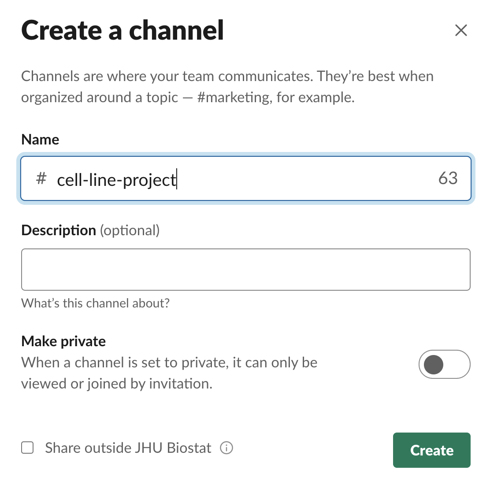

#### Features

##### Pins

If someone sends a really important message, like a link to a relevant document, you can "pin" the message so that it is easier to find later. 

Hovering over a message you will get the following options:

Clicking on the 3 dot button allows you to do several useful things for a message including pinning it to find it easily later.

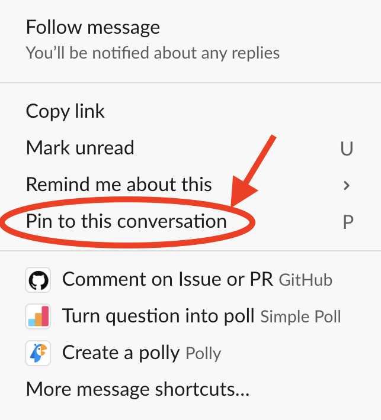

##### Code
One great feature about slack, is that it is very convenient to message about code.

You can also attach files directly to messages just like in the above message which has a screen shot image file.

##### Reminders

If you want to be reminded about a message in 20 minutes or next week you can also do that using the same hovering and 3 dot button option.

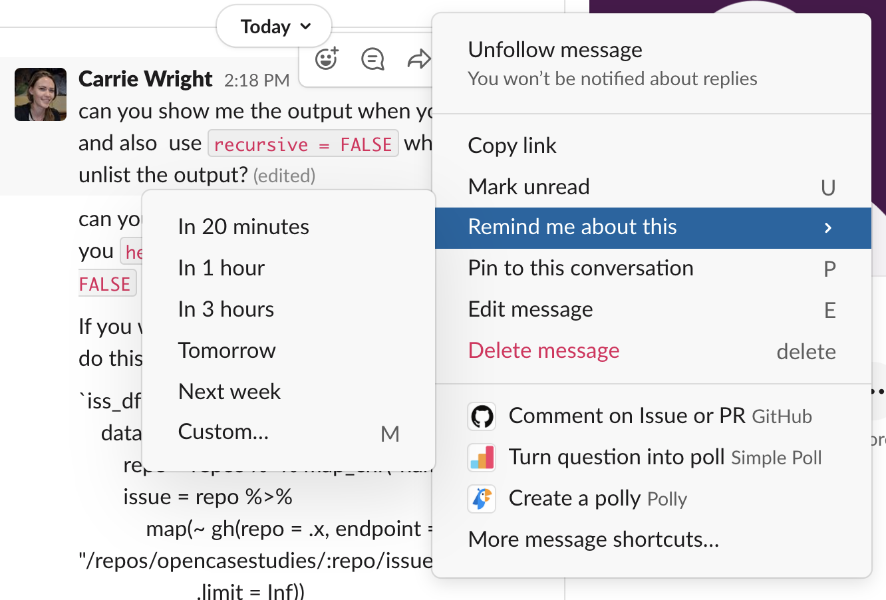

You may also notice in the image above that your messages can be **edited!** unlike an email.

##### Polls

One other nice feature for working with a team is that you can directly poll your team.

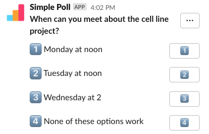

#### Git and GitHub

We will learn more about these tools in the Data Management portion of this course, however we will give a brief introduction now.

Informatics work can especially benefit from keeping track of your steps and the code that you have used. In some cases your lab may use a tool like [Galaxy](https://usegalaxy.org/) which has built in options for keeping track of the steps that your lab members are taking during their research. However, other tools do not have this option. Instead, we can use a tool called [Git](https://git-scm.com/) which allows for something called ["version control"](https://git-scm.com/book/en/v2/Getting-Started-About-Version-Control).

[Version control](https://en.wikipedia.org/wiki/Version_control) is the tracking of changes to a file or files overtime. This is equivalent to saving different versions of a grant proposal overtime. However, as you may have noticed, this is not an easy process to maintain. Tools like Git (of which Git is one of the most popular) help us to keep track of changes. If we save our changes often, we can easily modify our files back to a recent version if necessary. This may be less useful for a grant proposal (although we would argue that it really can be!) but it can be absolutely critical for your informatics code. 

Why is this?

Small changes in your code may result in your code breaking or generating completely different results. To make matters worse, sometimes your scripts may be lengthy, if you have 4,000 lines of code, it can be difficult to identify what is different between one version and another. Git really helps with this. 

AVOCADO add image

So what is [GitHub](https://en.wikipedia.org/wiki/GitHub)?

[GitHub](https://github.com/) is a free hosting site for code (or other files - including those grant proposals!). Therefore, all the different versions of your files can be saved and accessed online at GitHub. You can make these files private or public. 

According to Wikipedia:

> As of January 2020, GitHub reports having over 40 million users and more than 190 million repositories (including at least 28 million public repositories), making it the largest host of source code in the world.

You do not have to use GitHub to use Git. If you have data that needs to be complaint with HIPPA, you could still use Git on a local server (more on this in coming). Alternatively, you could use GitHub after you de-identify your data. 

AVOCADO more on using github with sensitive data.

https://github.com/truevault/hipaa-compliance-developers-guide

HIPPA compliancy group
https://compliancy-group.com/large-scale-hipaa-security-breach-improper-use-of-github/

reproducibility... (several options here...)

GitHub/Git

https://r-bio.github.io/intro-git-rstudio/

https://thenewstack.io/dont-mess-with-the-master-working-with-branches-in-git-and-github/

#### AVOCADO Docker??? for later with Figshare etc.
#### R Markdown /Jupyter

## Collaborating with Informatics Experts

Studies investigating biology research labs over history indicate that collaboration has been on the rise since the 1950s [[1]](https://doi.org/10.1016/j.endeavour.2013.03.001) and that the rate continues to increase [[2]](https://www.researchgate.net/publication/220040763_Scientific_collaboration). Indeed the size of biology research teams appear to have doubled from 1955 to 1990 [[1]](https://doi.org/10.1016/j.endeavour.2013.03.001). But why? 

### The benefits of collaboration  

1) **Shared cost** - Research often involves expensive technology, thus it is cost effective to share resources.    
2) **Shared expertise** - Now that technology affords answering in some cases more complex or broader research questions, it is often more effective to employ multiple contributors with different knowledge, skills, and perspectives. Researchers have noted that their own concept of their field changed as a result of working with investigators from other disciplines. Thus this can lead to innovation [[3]](https://link.springer.com/article/10.1007/s11024-019-09381-6). 
3) **Shared burden** - Doing part of the work for a project using the knowledge and skills that you are most comfortable with and seeking help from others who are more knowledgeable on other research aspects can be a more efficient strategy.
4) **Shared reliability** - Including multiple team members who can each evaluate the research can improve the reliability of a project, as mistakes can be found by other members.
5) **Shared credibility** - Collaborations involving experts of multiple areas can improve the perceived credibility of the work by others.

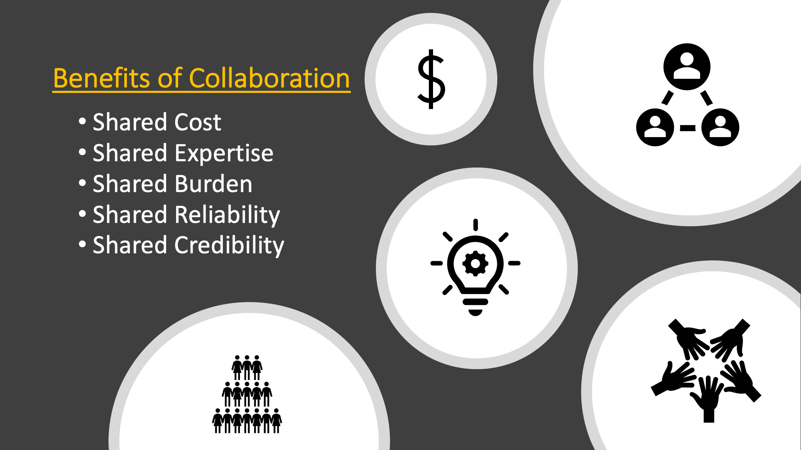

### Potential Challenges

There are always challenges when collaborating with others, but some of these are particularly enhanced in multi-disciplinary teams. Here are some challenges that you may encounter when a collaboration involves informatics experts.

Good Collaboration:

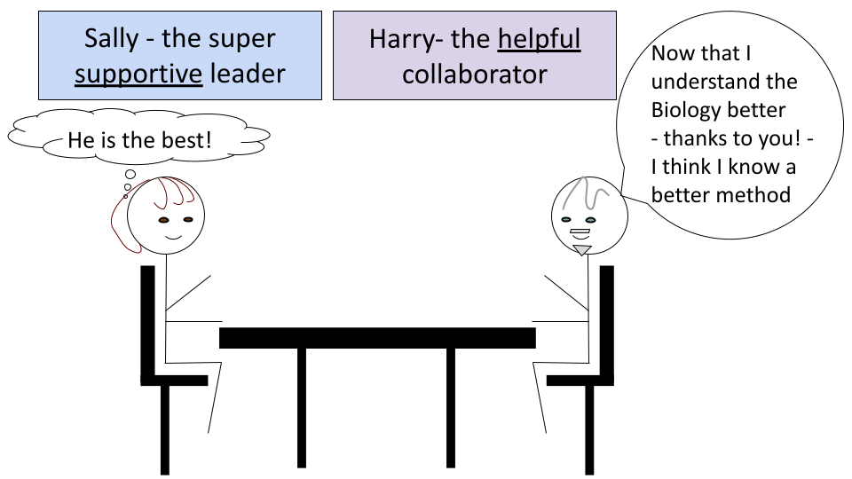

Bad collaboration:

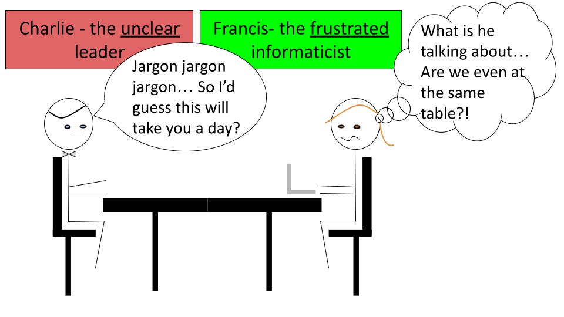

1) **Communication Differences** - Extra care needs to be taken to ensure that communication across groups is effective.  

Typically researchers will not meet as often with a collaborator as they would with an internal team member. Therefore, poor communication in a collaboration can lead to more costly misdirection and thus wasted time and effort.

Furthermore, as investigators often have different backgrounds, differences in jargon and language can make communication more challenging. 

Having **internal** team members with some **familiarity** with informatics can be very beneficial for translating discussions with collaborators who are informatics experts. 

One solution to this is to have **trainees work in both labs**. This can be especially beneficial for the trainee who will become accustomed to two research styles and will learn a diverse set of skills, allowing them to potentially have their own multi-disciplinary lab in the future [[3]](https://link.springer.com/article/10.1007/s11024-019-09381-6). 

Another important method that can help resolve this issue is to have members provide **educational seminars** for participating members about the fundamentals of their work.

2) **Different research style and goals** -  Beyond differences in language, differences in research style and goals can lead to conflict.

>"Scholars’ different styles of thought, standards, research traditions, techniques, and languages can be difficult to translate across disciplinary domains." [[3]](https://link.springer.com/article/10.1007/s11024-019-09381-6)

Making clear research standards and goals, as well as outlining clear specific tasks at the beginning of a project can help to avoid this issue. Furthermore, meeting consistently throughout the duration of a project can also help to make sure that standards are maintained.  Additionally, these meetings should include discussions about intellectual property, authorship, leadership, and defining what success looks likes to each of the various members. Defining these details early can avoid major conflict later. 

Furthermore, it is critical to keep in mind the diversity of career goals of research team members, as junior team members may have a challenging time persuading others of their independence and contributions when they work on largely collaborative projects.  It is also necessary to ensure that junior members have time to devote to their own research programs. [[2]](https://www.researchgate.net/publication/220040763_Scientific_collaboration) Support should be provided for these junior collaborators by more senior collaborators.

3) **Different capabilities** - Research of multi-disciplinary collaborations has revealed that when collaborating members are unclear of how their expertise and work contributes to the project, they are less motivated and fell less valued. 

Working with members of different backgrounds to determine how their expertise can contribute to the project, as opposed to simply assigning them a task, will not only help with morale, but it can also better define how a collaborator can further contribute to a project in ways that you may not already expect [[3]](https://link.springer.com/article/10.1007/s11024-019-09381-6).

4) **Reduced sense of responsibility** - Another concern of collaboration is that team members may feel less responsibility or commitment to a project than for a project within their own lab.

Defining tasks and expected due dates can help reduce this issue. Discussions to establish due dates should **always include** team members with **expertise in each area** of science, as tasks may not take the amount of time that another researcher would expect. It is a common misconception that informatics tasks take less time than the tasks actually take in reality. 

5) **Research is dynamic** - Research always has an element of trial and error. Protocols may change and new scientific questions may emerge. Frequent meetings with all group members to understand the dynamics of the project are critical. Furthermore, flexibility and understanding is required. It should be expected that aspects about the project will change.

6) **Different levels of resources** - Particularly when collaborating with community members, community colleges, and institutions that are "Equity-oriented" serving populations that have historically been marginalized or "minoritized" [[4]](https://diverseeducation.com/article/91247/), it is important to keep in mind that large differences in resources may exist between collaborating members. 

Sharing and discussing budget information early and often can help research members to understand what expectations are reasonable and how collaboration partners may best assist one another.

### References

1) Vermeulen, Niki, John N. Parker, and Bart Penders. “Understanding Life Together: A Brief History of Collaboration in Biology.” Endeavour 37, no. 3 (September 2013): 162–71. https://doi.org/10.1016/j.endeavour.2013.03.001.

2) Sonnenwald, Diane."Scientific collaboration."  Annual Review Of Information Science And Technology. 41 (2007): 643-681. https://www.researchgate.net/publication/220040763_Scientific_collaboration.

3) Mäkinen, Elina I., Eliza D. Evans, and Daniel A. McFarland. “The Patterning of Collaborative Behavior and Knowledge Culminations in Interdisciplinary Research Centers.” Minerva 58, no. 1 (March 2020): 71–95. https://doi.org/10.1007/s11024-019-09381-6.

4) Blake, Daniel. "The Case for Rebranding Minority-serving Institutions." DiverseEducation.com (January, 17, 2017) https://diverseeducation.com/article/91247/. 

## Employing informatics experts

In contrast to collaborating with informatics experts, in some case it may be beneficial to directly employ them on your team. There are again pros and and cons for this strategy.

By directly employing informatics experts, rather than collaborating with an expert, research leaders will have more access to meet with these experts more often. Research leaders may also have more sway in terms of guiding the direction of the experts' work. Leaders can also potentially grow the informatics part of their research program more readily, leading to even more flexibility in the research questions that they may be able to assess.

However, direct employment of informatics experts requires all of the typical responsibilities and costs of employing another lab member. It also requires the additional resource requirements for the informatics work of the particular expert. This will be discussed more in a later section of this course.  

In addition, it is useful to become familiar with best practices for ethics, reliability, and reproducibility in computational work. This requires some different tactics than that of experiment based research (often called "wet lab" research). Although it is also useful for informatics experts to keep track of the work that they have performed in general, similar to maintaining notes about experimental research with a lab notebook, a much deeper level of detail can be tracked and maintained for computational work. What we mean by this, is that the actual code and data used in their work can be saved over time. This can be invaluable for research reproducibility. Thus research leaders are advised to become familiar with best practices for data sharing and data management so that they can most effectively manage their informatics employees. This is also discussed in more detail later in the course.  Furthermore, it is very important to avoid issues that can happen if you employee a single bioinformatician that will be isolated from other informatics experts.

One other important thing to know is that informatics work is often best performed with long stretches of uninterrupted time to allow your informatics employees to perform "deep work". This will also be true for your informatics mentees.

Why is this? Some of the challenges that your informatics teammates will be working on will require a great deal of abstract thinking and troubleshooting. Such difficult work profits well from deep concentration. 

How can you accommodate this? Try to work with your informatics teammates when you schedule lab meetings and be mindful of other time commitments they might have, such as classes, seminars, or other meetings.

## Mentoring informatics students

Mentorship is a particularly unique relational experience. While traditional mentorship has been defined by the hierarchical structure of a single mentor who teaches subordinate mentees, new styles have emerged that are not as constrained or limited as the traditional paradigm. At its optimum, mentors and mentees should learn from each other and together and expand what each can do alone. Importantly the more traditional paradigm that does not value "reciprocal learning" as highly, has been shown to be less effective for a larger diversity of students.[[1]](https://doi.org/10.1111/nyas.14176)

For research groups that are newer to informatics, some of these less traditional paradigms may be especially useful, we will focus on a few here. 

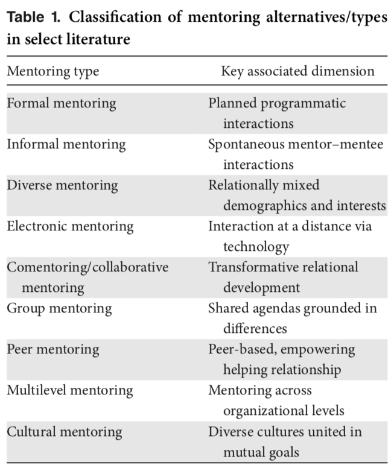

[[source]](https://doi.org/10.1111/nyas.14176)

### Co-mentoring/Collaborative/team mentoring

As we described earlier, co-mentoring or collaborative mentoring of students by multiple mentors with different backgrounds can be particularly beneficial to the student and also to the partnering labs. In the case of collaborative mentoring where a mentee is mentored by two research experts in two different labs, this provides an opportunity not only to strengthen a collaboration, but also for students to gain more diverse knowledge, and to in turn provide more of the expertise that they gain back to both labs. Co-mentoring could also occur within the same lab by a research leader and an informatics expert. This could also work well in a multilevel paradigm, where an informatics expert may guide informatics related aspects of research, while an overarching research adviser may guide the student's overall research mentorship experience.

### Peer mentoring

Peer mentoring also provides great opportunities to expand students' expertise and skills without as much time constraints for the research leaders of a lab, particularly for skills that may be new to lab leadership. Furthermore, such paradigms are helpful for improving students' teaching skills, collaboration skills, self-reliance, and self-confidence. Teaching a peer is often useful for students to identify gaps in their own knowledge, and assisting in their quest to "learn how to learn" [[1]](https://doi.org/10.1111/nyas.14176). Furthermore, such paradigms appear to be especially beneficial to students of historically marginalized populations.[[1]](https://doi.org/10.1111/nyas.14176) However, there are challenges for research leaders from a management standpoint. Mentors should be mindful of any conflicts that may arise between students. These can often be avoided with clear and distinct goals and projects for students, to avoid making students feel like they are competing with one another. Additionally, we highly recommend establishing a [code of conduct](https://i-sight.com/resources/18-of-the-best-code-of-conduct-examples/) for the lab, so that students and staff members are clear about what behavior is expected.

### Electronic mentoring 

With the COVID-19 pandemic, the transition to using electronic means of contact with students and staff for research has expanded on an unprecedented scale. It is unclear currently how much this will continue in the future. However, research prior to the pandemic has shown some surprising benefits of providing mentorship through electronic means. Importantly it appears that this eases burdens for students who are balancing course work, as it often provides more scheduling flexibility. Additionally, such mentorship is particularly helpful for historically marginalized populations who may face more hostility by going to research institutes with face-to-face interaction with others or may have additional scheduling conflicts. Even as we may return to more on-site research labs, additional availability by mentors with mentees using electronic means of contact are likely to be beneficial. Technology such as [slack](https://slack.com/) can be especially useful for allowing lab members to interact with one another. We will cover more about this soon.

### Career goals 

The job landscape for scientists has changed in recent decades with more opportunities outside academia in industry and government. Furthermore career goals for informatics mentees can be very different than that of other research mentees. By having informatics expertise, these trainees have **additional career opportunities**. 

Becoming aware of these opportunities yourself, as a research leader, is therefore critical for cultivating your mentees' awareness of the diversity of opportunities available to them. This will ultimately allow your mentees to choose the career path that suites them best. 

#### Career Paths for Informatics Mentees

1) Academia - Your informatics mentees may have career opportunities as principal investigators, scientists, or educators just like other cancer biology mentees. In addition to opportunities as educators for informatics and biology, they will also have opportunities for data science.

2) Government - Your informatics mentees will may have career opportunities as scientist or policy maker for research institutes just like other cancer biology mentees. However, additional agencies and institutes may have a need for their data science skills on topics outside of biology. For example your mentee may have the skills to work for a city police department.

3) Industry - Beyond the potential career options in the pharmaceutical industry, biotech, and medicine, your informatics mentees will have data science skills that may qualify them for jobs in a variety of industries. For example
your informatics mentees could find jobs at companies such as [Stitch Fix](https://www.stitchfix.com/) or [Ancestry](https://www.ancestry.com/) which use methods in machine learning and bioinformatics for their products. Additionally, your mentee may also have opportunities to join a software company as a computer programmer or even as a programming educator at a company like [RStudio](https://rstudio.com/). 

4) Nonprofit - Beyond research and management positions at nonprofits performing scientific or clinical research, informatics mentees may have opportunities at other nonprofits with other types of goals. For example, your mentee might find work at a nonprofit that advocates for civil rights and investigates social interactions in social media platforms.

According to [Brandon Rohrer](https://www.linkedin.com/in/brohrer/), a data scientists who formerly worked at [Facebook](https://en.wikipedia.org/wiki/Facebook) and now works at [iRobot](https://en.wikipedia.org/wiki/IRobot), there are 4 major categories of knowledge and skills for data science:

1) **Data Analysis** - domain knowledge, research skills, and interpretation skills  
2) **Data Modeling** - machine learning application skills, algorithm development skills  
3) **Data Engineering** - data management skills, skills to make code production-level ready (ex. automation), software engineering  
4) **Data Mechanics** - data formatting and cleaning, data handling (filtering, subsetting)  

_Archetypes of data scientists:_

1) Beginner data scientists - exposure in each of the 4 areas - ideally how your mentee will be after training at a minimum if their goal is to pursue a data science career
2) Generalist - proficient in all areas - data science manager or executive - good for mentees who wish to stay in research!
3) Specialists
  a) Detective - strong in data analysis and mechanics and exposure in all 4 areas
  b) Oracle - strong in modeling and mechanics (great for machine learning companies)
  c) Maker - strong in mechanics and engineering
  
<iframe width="560" height="315" src="https://www.youtube.com/embed/M_dc-XzApGA" frameborder="0" allow="accelerometer; autoplay; clipboard-write; encrypted-media; gyroscope; picture-in-picture" allowfullscreen></iframe>

<iframe width="560" height="315" src="https://www.youtube.com/embed/M_dc-XzApGA" frameborder="0" allow="accelerometer; autoplay; clipboard-write; encrypted-media; gyroscope; picture-in-picture" allowfullscreen></iframe>

<iframe width="560" height="315" src="https://www.youtube.com/embed/VOCYL-FNbr0" frameborder="0" allow="accelerometer; autoplay; clipboard-write; encrypted-media; gyroscope; picture-in-picture" allowfullscreen></iframe>

{type: video, poster: "http://img.youtube.com/vi/VOCYL-FNbr0/mqdefault.jpg"}

AVOCADO - add more about this
https://www.manning.com/books/build-a-career-in-data-science 

Major skill sets to focus on according to the "Build a Career in Data Science" book by Emily Robinson and Jacqueline Nolis:
1) statistics
2) Machine learning
3) programming (python and R)
4) projects - hands on experience

https://blogs.oracle.com/datascience/how-to-survive-your-data-science-interview

" When looking for jobs.. ignore job titles, dont pay too much attention to specific tools or languages...pay attention to the skills that are being asked for"

#### Authorship Considerations

There are also additional types of papers that your informatics mentee can publish, including:

1) Data resource papers, where your mentee may publish an article introducing a data resource
2) Software papers - an article where the functionality and development of piece of software is discussed

When guiding your mentee through the publication process, it is a good idea to keep in mind their career goals as you priortize different paper ideas. For example a mentee that is interested in pursuing a data engineering career may benefit more from a Software paper than other mentees.

### Mentoring underrepresented students

The inclusion of diverse populations in scientific teams has been shown to improve innovation [[2]](https://doi.org/10.1073/pnas.1915378117).

> Scholars from underrepresented groups have origins, concerns, and experiences that differ from groups traditionally represented, and their inclusion in academe diversifies scholarly perspectives. In fact, historically underrepresented groups often draw relations between ideas and concepts that have been traditionally missed or ignored [[2]](https://doi.org/10.1073/pnas.1915378117). 

However, analyses of scientific article authorship indicate that women are underrepresented in computational biology [[3]](https://doi.org/10.1371/journal.pcbi.1005134) and biomedical engineering [[4]](https://doi.org/10.1007/s10439-019-02222-3) and analyses of university faculty and students demonstrate that both women and historically marginalized populations (such as Black, Hispanic, and Native American) remain underrepresented in science, technology, engineering, and mathematics (STEM) fields in the US and in Europe[[2]](https://doi.org/10.1073/pnas.1915378117),[[5]](https://doi.org/10.1371/journal.pcbi.1008210). 

In order to best support and encourage mentees of underrepresented groups in cancer informatics, we suggest the following: 

1) Seek **training about disparities** in informatics and STEM career achievement and attitudes, biases, and stereotypes that are hindrances.

Note that you may not be aware of the barriers of achievement that your mentees may face. For example, mentees from low socioeconomic backgrounds, mentees with disabilities, mentees who have immigrated, older mentees, mentees of traditionally underrepresented races and ethnic groups, and mentees with gender identities that are underrepresented face unique and overlapping challenges. It is also important to learn about how **intersectionality** (the idea that  some individuals may represent more than one underrepresented group (ex. female and black)) results in more nuanced challenges. 

<iframe width="560" height="315" src="https://www.youtube.com/embed/ViDtnfQ9FHc" frameborder="0" allow="accelerometer; autoplay; clipboard-write; encrypted-media; gyroscope; picture-in-picture" allowfullscreen></iframe>

Become aware of **stereotype threat** - "an internal feeling and concern about confirming a negative stereotype associated with a group (e.g., racial, ethnic, gender, and age) with which the individual identifies"[[6]](https://doi.org/10.1111/nyas.14470) and how they might influence your mentees.

Also, become aware of as  **microaggressions* - "subtle verbal and nonverbal slights, insults, or invalidating remarks directed at individuals due to their membership in a group (e.g., racial, ethnic, gender, sexual orientation, and physical disability), which are rooted in biases about individuals in that group"[[6]](https://doi.org/10.1111/nyas.14470).

See [here](https://www.messiah.edu/download/downloads/id/921/Microaggressions_in_the_Classroom.pdf) for a list of examples.

Importantly, "mentors for students with disabilities should receive training, as needed, on their mentee’s specific disability and should be made aware of the accommodations that students may need to succeed in activities and courses" [[6]](https://doi.org/10.1111/nyas.14470). 

2) **Appreciate and acknowledge mentee's differences**. Research shows that mentees of underrepresented racial groups would prefer their mentors to directly discuss their background differences and how to best cultivate the mentee's career success given their background. An attitude of ["color-blindness"](https://doi.org/10.1016/j.jesp.2011.09.010) about race has shown to hinder the success of mentees [[7]](http://dx.doi.org/10.1037/dhe0000106),[[8]](https://doi.org/10.1016/j.jesp.2011.09.010). 

**However, singling out individuals for their differences is often felt as a microaggression.**  There are ways to discuss these topics with your student in private without singling them out in front of the rest of a group.

> "Racial/ethnic differences between mentees and mentors in interracial mentoring relationships can pose cultural barriers to effective mentoring of HU (Historically underrepresented) students and even affect students’ professional and psychosocial success, especially when complex racial/ethnic issues are not effectively handled or addressed..." [[7]](http://dx.doi.org/10.1037/dhe0000106)

>Two ideological perspectives – **colorblindness and multiculturalism** – have emerged to shed light on this question. Colorblindness downplays the salience and importance of race by focusing on the commonalities people share, such as one's underlying humanity. In contrast, multiculturalism acknowledges and highlights racial differences [[8]](https://doi.org/10.1016/j.jesp.2011.09.010).

>"Exposure to colorblind (vs. multicultural) messages predicts negative outcomes among Whites such as greater implicit and explicit racial bias ([Richeson & Nussbaum, 2004](https://www.sciencedirect.com/science/article/pii/S002210311100240X?via%3Dihub#bb0080))"  [[8]](https://doi.org/10.1016/j.jesp.2011.09.010)

> "Not only do minorities prefer multiculturalism ([Ryan et al., 2007](https://www.sciencedirect.com/science/article/pii/S002210311100240X?via%3Dihub#bb0085), [Verkuyten, 2006](https://www.sciencedirect.com/science/article/pii/S002210311100240X?via%3Dihub#bb0105)), they benefit when others around them endorse multiculturalism ([Plaut et al., 2009](https://www.sciencedirect.com/science/article/pii/S002210311100240X?via%3Dihub#bb0070))"[[8]](https://doi.org/10.1016/j.jesp.2011.09.010)

3) **Work to create a safe environment**. Educate lab mentors about cultural sensitivity and microaggressions. Highlight the importance of collaboration and create a [code of conduct](https://i-sight.com/resources/18-of-the-best-code-of-conduct-examples/) for the lab.

4) **Role models** make career goals seem possible. Expose all mentees to a diverse range of role models through seminars, journal clubs, and participation in conferences.

Computational biology papers with female authors are more likely to have a last author is also female. It is unclear if this is because women are more likely to hire other women and or if females are more likely to choose a lab with a female adviser [[3]](https://doi.org/10.1371/journal.pcbi.1005134). 

Indeed, research of females and other underrepresented groups in STEM including students with disabilities and of certain racial and ethnic groups suggests that role models of underrepresented populations are particularly important for recruiting and keeping students interested in fields where they may feel like an outsider [[6]](https://doi.org/10.1111/nyas.14470). One strategy to encourage students of underrepresented populations is to provide students with exposure to such role models through regular seminars where scientists who represent these populations are prominent [[9]](https://doi.org/10.1641/B570705). 

5) **Advocate for all mentees**, particularly those from underrepresented groups by introducing your mentee to other scientists and trainees, encouraging the participation of your mentees in support programs and groups such as graduate student groups and helping mentees cultivate self advocacy practices through open discussions and encouragement.

6) Support a **healthy relationship with failure** by being a good role model and openly discussing the role of failure in research. For example, you may describe failures in your own career or you may read some of the book Brilliant Blunders by Mario Livio with your mentees. This book describes how scientific advancement actually occurred due to mistakes of some of the most respected scientists. Educating mentees about the **[Growth Mindset](https://www.brainpickings.org/2014/01/29/carol-dweck-mindset/)** described by Carol Dweck may also be helpful. The major themes of this mindset is an awareness that our abilities are not fixed, we can change our aptitudes with practice and work. 

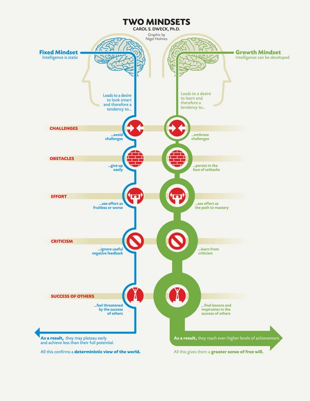

[[source]](https://www.brainpickings.org/2014/01/29/carol-dweck-mindset/)

7) **Celebration and microaffirmations**  Be sure to celebrate all of your mentees' small and large successes. This has been shown to promote confidence and resilience [[6]](https://doi.org/10.1111/nyas.14470).

8) **Give feedback with cultural sensitivity** - It is important to be aware that your mentee may be struggling with feeling like they don't belong when you provide feedback [[6]](https://doi.org/10.1111/nyas.14470), [[10]](https://doi.org/10.1038/447791a).

9) In addition to creating a [code of conduct](https://i-sight.com/resources/18-of-the-best-code-of-conduct-examples/) for the lab, consider creating a document that outlines **mentor and mentee expectations**. See [here](https://doi.org/10.1371/journal.pcbi.1005709.s001) for an example of such document  [[11]](https://doi.org/10.1371/journal.pcbi.1005709) and see [here](https://ictr.wisc.edu/mentoring/) for more information. Keep in mind that such forms should be tailored for different career stages of your mentees and for mentees who are pursuing different expertise. Informatics mentees should incorporate guidelines about data management practices.  

<iframe width="560" height="315" src="https://www.youtube.com/embed/yiZQaE0q9BY" frameborder="0" allow="accelerometer; autoplay; clipboard-write; encrypted-media; gyroscope; picture-in-picture" allowfullscreen></iframe>

### Refrences

1) Mullen, Carol A., and Cindy C. Klimaitis. “Defining Mentoring: A Literature Review of Issues, Types, and Applications.” Annals of the New York Academy of Sciences 1483, no. 1 (January 2021): 19–35. https://doi.org/10.1111/nyas.14176.

2) Hofstra, Bas, Vivek V. Kulkarni, Sebastian Munoz-Najar Galvez, Bryan He, Dan Jurafsky, and Daniel A. McFarland. 2020. “The Diversity–Innovation Paradox in Science.” Proceedings of the National Academy of Sciences 117 (17): 9284–91. https://doi.org/10.1073/pnas.1915378117

3) Bonham, Kevin S., and Melanie I. Stefan. “Women Are Underrepresented in Computational Biology: An Analysis of the Scholarly Literature in Biology, Computer Science and Computational Biology.” Edited by Carl T. Bergstrom. PLOS Computational Biology 13, no. 10 (October 12, 2017): e1005134. https://doi.org/10.1371/journal.pcbi.1005134.

4) Aguilar, Izath Nizeet, Venkateswaran Ganesh, Rachel Mannfeld, Riley Gorden, Jennifer M. Hatch, Shatoria Lunsford, Elizabeth C. Whipple, Randall T. Loder, and Melissa A. Kacena. 2019. “Authorship Trends Over the Past 30-Years in the Annals of Biomedical Engineering.” Annals of Biomedical Engineering 47 (5): 1171–80. https://doi.org/10.1007/s10439-019-02222-3.

5) Chaudhary, V. Bala, and Asmeret Asefaw Berhe. 2020. “Ten Simple Rules for Building an Antiracist Lab.” Edited by Russell Schwartz. PLOS Computational Biology 16 (10): e1008210. https://doi.org/10.1371/journal.pcbi.1008210.

6) Stelter, Rebecca L, Janis B Kupersmidt, and Kathryn N Stump. “Establishing Effective STEM Mentoring Relationships through Mentor Training.” Ann. N.Y. Acad. Sci., 1483 (2021): 224–243.  https://doi.org/10.1111/nyas.14470

7) Byars-Winston, Angela, Patrice Leverett, Ross J Benbow, Christine Pfund, Nancy Thayer-Hart, and Janet Branchaw. “Race and Ethnicity in Biology Research Mentoring Relationships,” Journal of Diversity in Higher Education, 13, No. 3 (2020): 240–253. http://dx.doi.org/10.1037/dhe0000106

8) Holoien, Deborah Son, and J. Nicole Shelton.  “You Deplete Me: The Cognitive Costs of Colorblindness on Ethnic Minorities.” Journal of Experimental Social Psychology 48 No. 2 (2012): 562–65. https://doi.org/10.1016/j.jesp.2011.09.010.

9) Katz, Samantha. “Mentoring Women in the Biological Sciences: Is Informatics Leading the Pack?,” : BioScience, 57(7) (2007): 559. https://doi.org/10.1641/B570705.

10) Lee, Adrian, Carina Dennis, and Philip Campbell. “Nature’s Guide for Mentors.” Nature 447, no. 7146 (June 2007): 791–97. https://doi.org/10.1038/447791a.

11) Masters, Kristyn S, and Pamela K Kreeger. “Ten Simple Rules for Developing a Mentor–Mentee Expectations Document,” PLOS Computational Biology,3 No.9 (September 21, 2017): e1005709.  https://doi.org/10.1371/journal.pcbi.1005709

